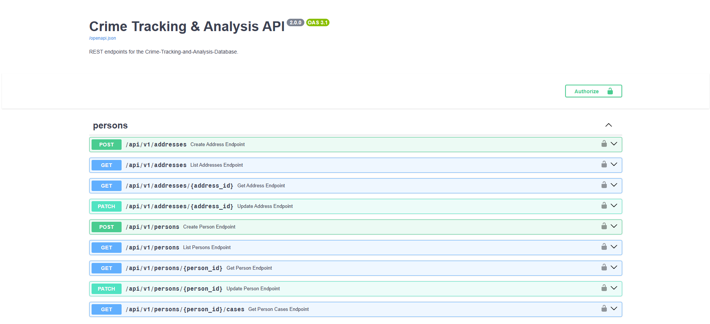

# 📁 Crime Tracking and Analysis Database

**Crime Tracking and Investigation System**

A backend API system for managing criminal investigations. 
The system supports case management, evidence tracking, witness testimony, suspect identification, trial records, and crime analytics.

Built using FastAPI and PostgreSQL with a clean layered architecture, this project models the lifecycle of a criminal case — from reporting and evidence collection to trials and punishments. It simulates a crime investigation management system where complex relationships between suspects, victims, officers, cases, court trials information and evidence are stored and queried efficiently using SQL and relational principles.

---

## 🛠️ Technologies Used

- **Framework:** FastAPI (High performance, async support)
- **Database:** PostgreSQL (Relational integrity, advanced querying)
- **ORM:** SQLAlchemy (Database interaction & modeling)
- **Data Validation:** Pydantic (Type hints, automated serialization)
- **Authentication Strategy:** JWT (JSON Web Tokens)
- **API Documentation:** Auto-generated via OpenAPI (Swagger UI)

---

## 🏗️ Architecture Overview

The backend follows a layered architecture to maintain separation of concerns:

```plaintext
Client
  ↓
FastAPI Routes (HTTP layer)
  ↓
Pydantic Schemas (validation & serialization)
  ↓
CRUD Layer (database operations)
  ↓
PostgreSQL Database
```

Dependencies such as database sessions are injected using FastAPI's dependency system.

---

## 📁 Project Structure

```plaintext
App/
  API/            → FastAPI route definitions
  CRUD/           → database operations
  schemas/        → Pydantic request/response models
  db/             → database session and models
  core/           → shared utilities and configuration

Database/
  schema.sql      → database schema
  seed_data.sql   → initial test data

tests/
  unit and API tests
```

---

## ✨ Features Implemented

- Case management (open, update, close cases)
- Evidence tracking
- Witness testimony management
- Suspect tracking and status updates
- Victim management
- Trial management and punishment records
- Crime hotspot analytics
- Structured REST API using FastAPI
- Data validation using Pydantic schemas
- PostgreSQL relational database design

---

## 🔒 Authentication

The system implements robust JWT-based authentication to secure the API.

Capabilities:
- User login with JWT token issuance
- Protected endpoints using FastAPI dependency injection
- Role-based access control for investigators, officers, and analysts
- Secure password hashing using bcrypt

Password reset via OTP is planned for a future release.

---

## 🧠 Database Design

The database is implemented in PostgreSQL using a normalized relational schema.

Core entities:
- `Person`
- `Address`
- `Case`
- `Evidence`
- `Witness`
- `Suspect`
- `Victim`
- `Trial`
- `Punishment`

The system models real-world investigation workflows and supports relationships between entities such as cases, suspects, and evidence. All tables are normalized and satisfy BCNF for data consistency and integrity.

---

## 📚 API Documentation

Interactive API documentation is automatically provided via OpenAPI/Swagger UI. This allows developers to test endpoints directly from the browser effortlessly.

Navigate to `/docs` in the application to access the interactive endpoints interface:



---

## 🚀 Setup Instructions

Follow these steps to run the backend API with its PostgreSQL database.

1. **Install Docker Desktop**

   Docker is required because the project runs the API and PostgreSQL database as containers.

   You do not need to install PostgreSQL or pgAdmin separately.

2. **Clone the repository**

   ```bash
   git clone <repository-url>
   ```

3. **Open the project folder**

   ```bash
   cd Crime-Tracking-and-Analysis-Database
   ```

4. **Start the backend and database**

   ```bash
   docker compose up --build
   ```

   This command builds the FastAPI backend image, starts PostgreSQL, creates the `crimedb` database, and loads the schema and seed data from the `Database` folder.

5. **Open the API documentation**

   After the containers are running, open:

   ```text
   http://localhost:8000/docs
   ```

6. **Stop the project**

   Press `Ctrl + C` in the terminal where Compose is running, then run:

   ```bash
   docker compose down
   ```

7. **Reset the database if needed**

   The SQL files run only the first time the database volume is created. If you change `Database/schema.sql` or `Database/seed_data.sql` and want to rebuild the database from scratch, run:

   ```bash
   docker compose down -v
   docker compose up --build
   ```

---

## 🔮 Future Improvements

- Password reset via OTP
- Case analytics dashboards
- Improved indexing for query optimization
- Frontend dashboard for investigators

---

## 👥 Team Members
- Manan Chhabhaya
- Kresha Vora
- Anushka Prajapati
- Kashyap Ajudiya
- Jal Khunt
